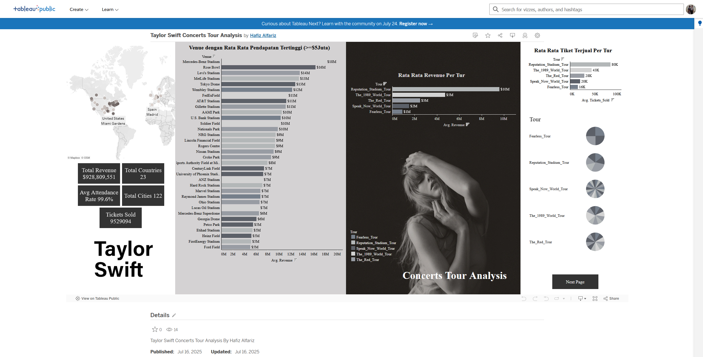
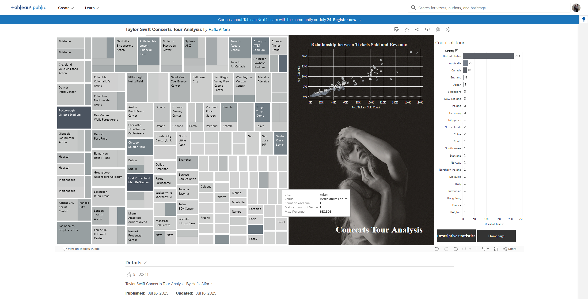

# Taylor Swift Concerts Tour Analysis

## Project Overview

This repository presents a comprehensive data analysis of Taylor Swift's concert tours from 2009 to 2018. The objective is to deliver actionable business insights for artist management, promoters, and event organizers by examining venue profitability, attendance patterns, and the impact of opening acts.

## Repository Structure

```
1. taylor_swift_concert_analysis.ipynb   - Main Python notebook for data cleaning, analysis, and visualization
2. taylor_swift_clean_data.csv           - Cleaned dataset ready for analysis and dashboard
3. taylor_train.csv                      - Raw master dataset
4. png/dasboard_page1.png, dasboard_page2.png, dasboard_page3.png - Tableau dashboard visualizations
```

## Problem Background

Artist tour management and event organizers often lack data-driven insights into the most profitable venues, attendance patterns by location, and the impact of opening acts on tour performance. Without an analytical dashboard to answer these questions, promotional strategies are inefficient and ROI is difficult to maximize.

## Project Output

- Cleaned dataset for further analysis and dashboard creation in Tableau
- Python notebook with full data cleaning, exploration, and statistical analysis
- Tableau dashboard visualizing key findings and answering business questions

## Data Description

- 445 entries, 7 columns
- Contains missing values and special characters that require cleaning
- Source: [Taylor Concert Tours Impact on Attendance and Revenue](https://www.kaggle.com/datasets/gayu14/taylor-concert-tours-impact-on-attendance-and?resource=download)

## Methodology

- **Data Cleaning:** Handling missing values, standardizing columns, removing duplicates
- **Data Exploration:** Descriptive statistics, visualizations, outlier analysis
- **Statistical Analysis:** Inferential statistics, correlation analysis, hypothesis testing

## Technology Stack

- Python (pandas, matplotlib, seaborn, numpy, plotly)
- Tableau Public for dashboard visualization

## Reference

- Tableau dashboard: [Taylor Swift Concerts Tour Analysis by Hafiz Alfariz](https://public.tableau.com/app/profile/hafiz.alfariz/viz/TaylorSwiftConcertsTourAnalysisByHafizAlfariz/TaylorSwiftConcertTourAnalysisPage1)

---

## Tableau Dashboard Preview

Below is a preview of the Tableau dashboard included in this repository:




---

## Installation & Usage

1. Clone this repository.
2. Open `taylor_swift_concert_analysis.ipynb` in Jupyter Notebook or VS Code.
3. Run all cells to reproduce the analysis and generate the cleaned dataset.
4. Use `taylor_swift_clean_data.csv` for further analysis or dashboard creation in Tableau.

## Contact

For questions or collaboration, please contact Hafiz Alfariz via [LinkedIn](https://www.linkedin.com/in/hafizalfariz/) or GitHub.

---

**Additional References:**
- [Markdown Syntax Guide](https://docs.github.com/en/get-started/writing-on-github/getting-started-with-writing-and-formatting-on-github/basic-writing-and-formatting-syntax)
- [How to Write a Good README](https://www.freecodecamp.org/news/how-to-write-a-good-readme-file/)